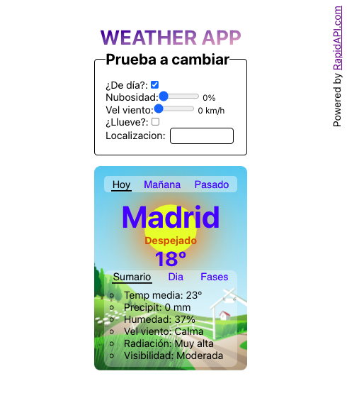

# Weather APP

Aplicación web que muestra **animaciones en tiempo real** en función del tiempo meteorológico de la ciudad en la que te encuentras

Autor: Ángel González

# Deploy

- Frontend: https://weather2d.up.railway.app/
- Backend: https://weatheranimatedbackend.up.railway.app/

# Tecnología usada

- Frontend: React https://github.com/kant003/weather2D
- Backend: NodeJs https://github.com/kant003/weatherAnimatedBackend

# Recursos

- API meteorológica RapidApi.com https://rapidapi.com/
- Editor de svg https://boxy-svg.com/
- Optimizador de svg https://github.com/svg/svgo
- Repositorio svg https://www.uidownload.com/
